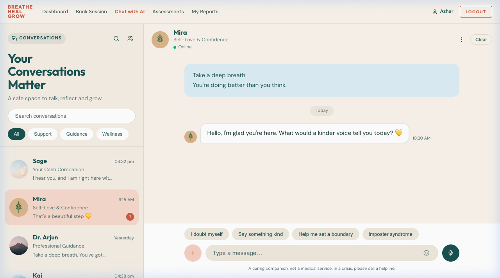
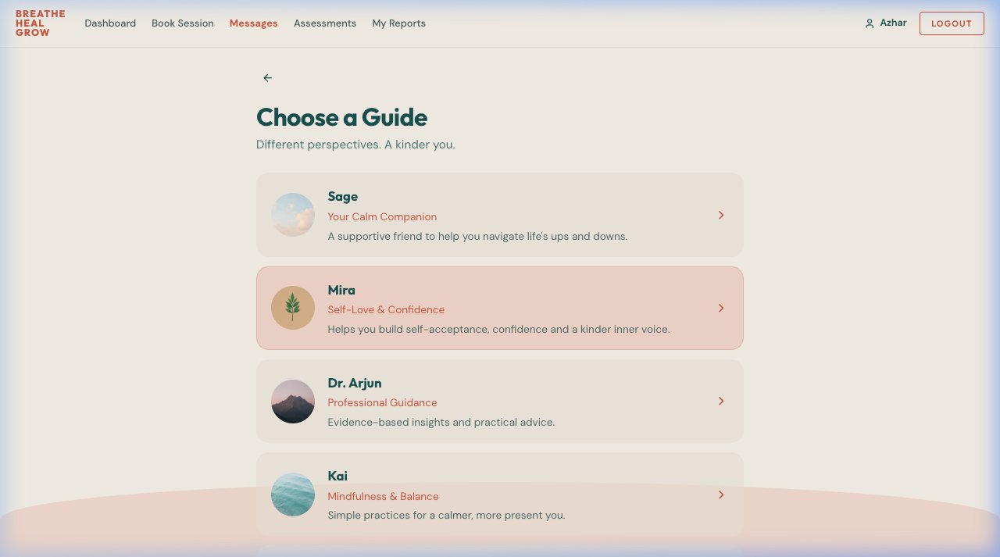
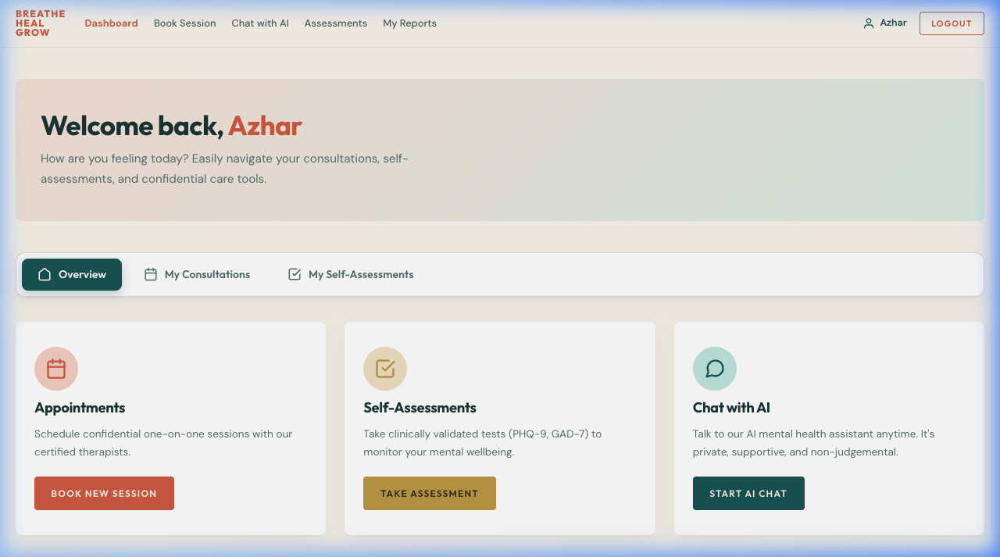
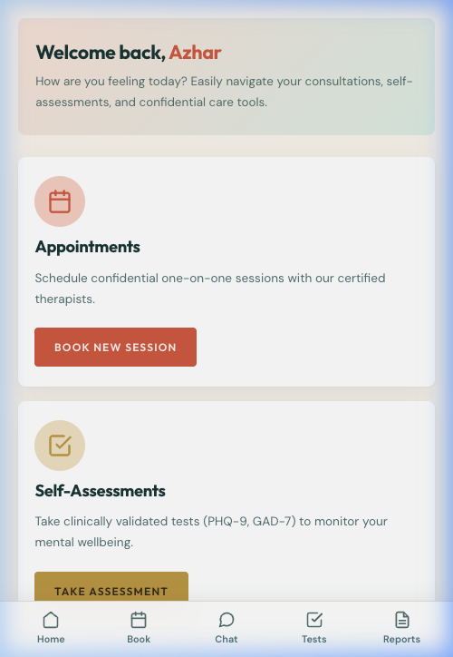
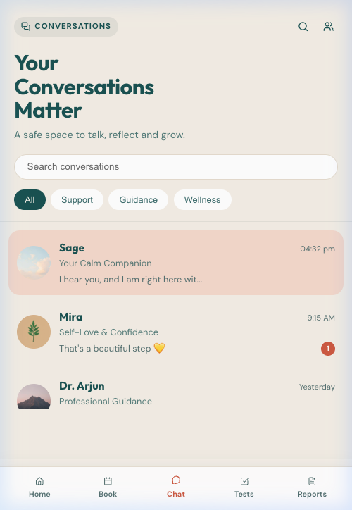
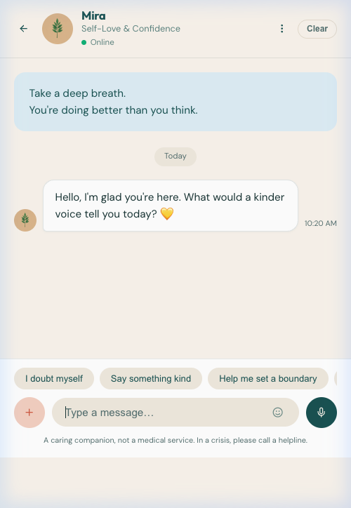

# 🌿 Breathe Heal Grow

<p align="center">
  <strong>A compassionate, modern mental healthcare & AI wellness companion platform.</strong>
</p>

<p align="center">
  <a href="https://breathe-heal-grow.onrender.com" target="_blank">
    
  </a>
  
  
  
</p>

<p align="center">
  🌐 <strong>Live Application:</strong> <a href="https://breathe-heal-grow.onrender.com" target="_blank">https://breathe-heal-grow.onrender.com</a>
</p>

---

## ✨ Overview

**Breathe Heal Grow** bridges the gap between everyday emotional wellbeing and clinical therapy. It provides a safe, welcoming, non-judgmental space where users can reflect with specialized AI wellness companions, complete clinically validated psychological assessments, and book confidential consultations with licensed therapists.

---

## 📸 Visual Showcase

### 💬 Companion Guides & Active Chat
> Reflect with specialized AI guides crafted for support, self-love, guidance, and mindfulness.



### 🌿 Companion Guides Directory
> Choose from 6 distinct companion personas tailored to your emotional journey.



### 📊 Patient Dashboard (Desktop)
> Seamless access to upcoming consultations, validated clinical assessments, and personal care tools.



### 📱 Native-Feel Mobile Experience
> Clean, distraction-free mobile layout with unified bottom navigation.

| Mobile Dashboard | Conversations List | Active Guide Thread |
| :---: | :---: | :---: |
|  |  |  |

---

## 🌟 Key Highlights

- **🤖 6 Companion Personas**:
  - **Sage** (*Calm Companion*) — Soothing emotional grounding and anxiety de-escalation.
  - **Mira** (*Self-Love & Confidence*) — Cultivating inner strength and self-compassion.
  - **Dr. Arjun** (*Professional Guidance*) — Structured, reflective psychological insights.
  - **Kai** (*Mindfulness & Balance*) — Daily breathwork and stress relief routines.
  - **Luna** (*Sleep & Relaxation*) — Nighttime decompression and restorative wind-downs.
  - **Aroha** (*Life Transitions*) — Resilience during major personal changes.
- **📅 Confidential Consultations**:
  - Search licensed therapists by clinical specialization.
  - Real-time calendar slot reservation and appointment management.
- **📋 Clinically Validated Assessments**:
  - Standardized screening questionnaires: **PHQ-9** (Depression), **GAD-7** (Anxiety), **PSS-10** (Perceived Stress), and **ISI** (Insomnia Severity Index).
  - Instant scoring with severity tier classification and guidance.
- **🩺 Therapist Clinical Hub**:
  - Clinician dashboard for managing consultations, reviewing patient histories, and configuring availability.
- **📱 Responsive by Design**:
  - Uniform desktop top navigation bar.
  - Native bottom navigation bar on mobile for ergonomic single-hand usage.

---

## 🛠️ Technology Stack

- **Backend**: Java 17, Spring Boot 3, Spring Data JPA, Spring Security 6
- **Database**: PostgreSQL (Production) / H2 In-Memory (Development)
- **Frontend**: Thymeleaf, Modern Vanilla CSS, Lucide Icons
- **AI Intelligence**: Multi-Provider LLM Integration (Groq, Google Gemini) with automatic key rotation and fallback
- **Deployment**: Docker containerization on Render

---

## 🚀 Getting Started Locally

### Prerequisites
- **JDK 17** or higher
- **Maven** (or use the included `./mvnw` wrapper)

### 1. Clone the Repository
```bash
git clone https://github.com/azharkhan924/mental-health-app.git
cd mental-health-app
```

### 2. Configure Environment Variables (Optional for AI Chat)
Create an `.env` file or export your preferred API keys:
```bash
export AI_PROVIDER=groq
export GROQ_API_KEYS="your_groq_api_key_here"
# Optional Gemini fallback
export GEMINI_API_KEYS="your_gemini_api_key_here"
```

### 3. Run the Development Server
```bash
./mvnw spring-boot:run -Dspring-boot.run.profiles=dev
```
Open **`http://localhost:8080`** in your browser.

---

## 📄 License

This project is open source and available under the [MIT License](LICENSE).
